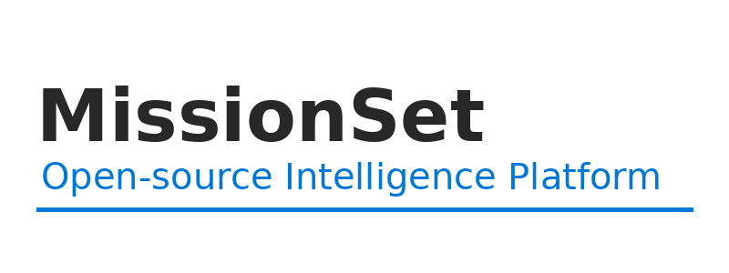

# 

---

## 📖 Overview
**MissionSet** is an open-source, readily deployable platform for intelligence gathering and dissemination.  
The goal is to provide a flexible, modular system that can be quickly adapted to meet diverse operational needs.

---

## 📌 Current Development Milestones

- **Core Platform**
  - Modular architecture with support for addon modules
  - Initial modules:
    - Medical
    - Radio
    - Mission & target management
- **Deployment**
  - Turnkey Docker deployment
- **Access & Security**
  - Deployable access management
  - Authentication with permission control
- **Data & Reporting**
  - Document exporting
  - Report templates
  - Email integration
  - Encrypted report sending

---

## 🚀 Future Roadmap

- **Deployment**
  - Bare-metal installation support
- **Mobile Applications**
  - iOS and Android apps
  - Secure data sharing between deployments
- **Networking & Security**
  - WireGuard-based secure access
  - Encrypted communications:
    - App-to-server
    - Server-to-server

---

## 🛠 Tech Stack (Planned/Current)
- **Containerization:** Docker (future: bare-metal support)
- **Security:** WireGuard VPN, role-based authentication
- **Data Exchange:** Encrypted communication channels
- **Integrations:** Email and reporting tools

---

## 🤝 Contributions
We welcome contributions from developers, testers, and security researchers.  
Please submit issues or pull requests via GitHub.

---

## 📜 License
This project is licensed under the [MIT License](LICENSE).
